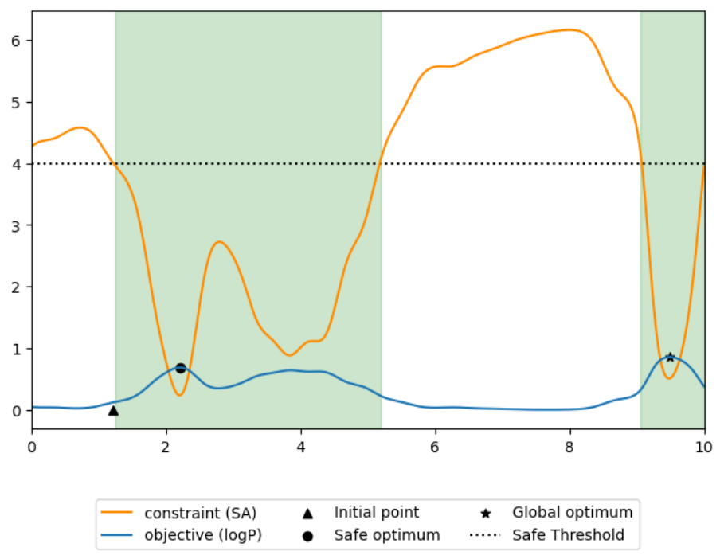

# Bayesian Optimization for Drug Candidate Design

This project implements a **Bayesian Optimization (BO)** framework to optimize the structural features of a drug candidate. The goal is to maximize bioavailability $`logP`$ while ensuring the synthesizability constraint $`SA < \kappa`$ is satisfied.

## Problem Formulation
Let $`x \in [0, 10]`$ represent the structural features. The optimization problem is formalized as:
```math
x^* = \arg\max_{x \in X, \, v(x) < \kappa} f(x)
```
where:
- $`f(x)`$: Bioavailability ($`logP`$).
- $`v(x)`$: Synthesizability score ($`SA`$).
- $`\kappa = 4`$: Maximum allowed synthesizability.

The observed values are noisy:
```math
y_f = f(x) + \epsilon_f, \quad \epsilon_f \sim \mathcal{N}(0, \sigma_f^2)
```
```math
y_v = v(x) + \epsilon_v, \quad \epsilon_v \sim \mathcal{N}(0, \sigma_v^2)
```
where $`\sigma_f = 0.15`$ and $`\sigma_v = 0.0001`$.

An example problem looks as follows: 

<div align="center">
  
</div>


## Approach
### Gaussian Process Modeling
Two Gaussian Processes (GPs) are used:
1. For $`f(x)`$: Bioavailability
   - Kernel options: Matérn ($`\nu = 2.5`$) or RBF.
   - Tunable parameters: Variance and length scale.
2. For $`v(x)`$: Synthesizability
   - Kernel: Additive (Linear + Matérn or RBF).
   - Prior mean: $`4`$.

### Acquisition Functions
The algorithm implements three acquisition functions for constrained optimization:
1. **Upper Confidence Bound (UCB):**

   $`\text{UCB}(x) = \mu_f(x) + \beta \cdot \sigma_f(x) - \max(0, \mu_v(x) - \kappa)`$
   

3. **Constrained Expected Improvement (CEI):**
   
   $`\text{CEI}(x) = EI(x) \cdot P(v(x) < \kappa)`$
   
   where $`EI(x)`$ is the Expected Improvement.

5. **Probability of Feasibility (PoF):**
    
   $`\text{PoF}(x) = \Phi\left(\frac{\kappa - \mu_v(x)}{\sigma_v(x)}\right)`$
   
   where $`\Phi`$ is the CDF of the standard normal distribution.


### Constraints and Safe Initialization
- The optimization starts from an initial safe point $`x_\triangle`$ where $`v(x_\triangle) < \kappa`$.
- Unsafe evaluations ($`v(x) \geq \kappa`$) are penalized.

## Results and Evaluation
### Metrics
The algorithm's performance is evaluated using **normalized regret**:
```math
r_j = \max\left(\frac{f(x_\bullet) - f(\tilde{x}_j)}{f(x_\bullet)}, 0\right)
```
where $`x_\bullet`$ is the local optimum and $`\tilde{x}_j`$ is the suggested solution.

The final score combines regret, penalties for unsafe evaluations, and trivial solutions:
```math
S_j = 1 - 0.4 \cdot r_j - 0.6 \cdot h(3N_j - 3.25) - 0.15 \cdot I[|\tilde{x}_j - x_\triangle| \leq 0.1]
```
where $`N_j`$ is the number of unsafe evaluations and $`h(\cdot)`$ is the sigmoid function.
- **Final Score**: 0.863 (ranked 90/273)

### Visualization
The algorithm generates:
1. Posterior plots of $`f(x)`$ and $`v(x)`$, including uncertainty bounds.
2. Acquisition function values for each iteration.
3. Safe and unsafe evaluation regions.
